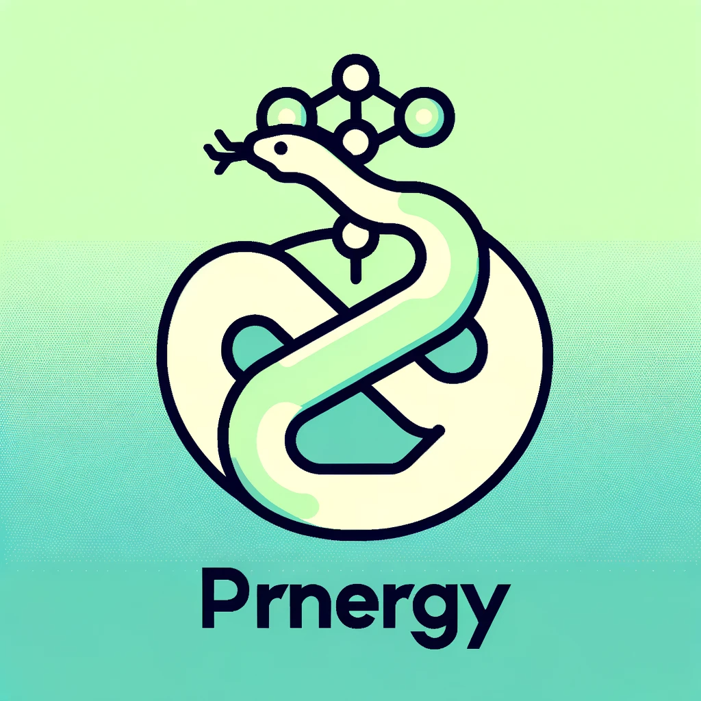

# Prenergy: A Chemical Energy Prediction Library

Prenergy is a Python library designed for chemical energy prediction. Leveraging the power of machine learning and chemoinformatics, Prenergy provides a streamlined interface for feature engineering and predictive analytics for chemical reactions. The library includes modules for data featurization and machine learning models specifically tailored for chemical data.

## Project Structure

```plaintext
.
├── docs
├── Examples
│   └── example.ipynb
├── prenergy
│   ├── chemicaldatafeaturizer.py
│   ├── chemicalpredictor.py
│   └── __init__.py
├── requirements.txt
├── setup.py
└── _files
    └── model_300dim.pkl
```

## Features

- Chemical Data Featurization: Extract useful features from chemical data.
- Predictive Modeling: Pre-trained and customizable machine learning models for predicting chemical reaction energies.
- Easy-to-use API: Designed for both novice and expert users.

## Installation

To install the package, run:

```bash
pip install repo_name
```

Or, to install the package from the source code, navigate to the root directory and run:

```bash
python setup.py install
```

## Usage

For a comprehensive example, check the Jupyter notebook under `Examples/example.ipynb`.

Quick example:

```python
from prenergy import chemicaldatafeaturizer, chemicalpredictor

# Initialize the featurizer and predictor
featurizer = ChemicalDataFeaturizer(data_file="your_data.csv")
predictor = ChemicalPredictor(model_file="your_model.pkl")

# Generate features
features = featurizer.generate_features()

# Train and evaluate the model
predictor.fit_and_evaluate(features)
```

## Documentation

For more detailed information, please check the `docs` directory.

## Dependencies

All the dependencies are listed in the `requirements.txt` file. They can be installed using:

```bash
pip install -r requirements.txt
```

## Contributing

We welcome contributions! Please see `docs/CONTRIBUTING.md` for details on how to contribute.

## License

This project is licensed under the MIT License - see the `LICENSE` file for details.

---

For more information, please refer to the documentation in the `docs` directory. Feel free to report any issues or make feature requests.